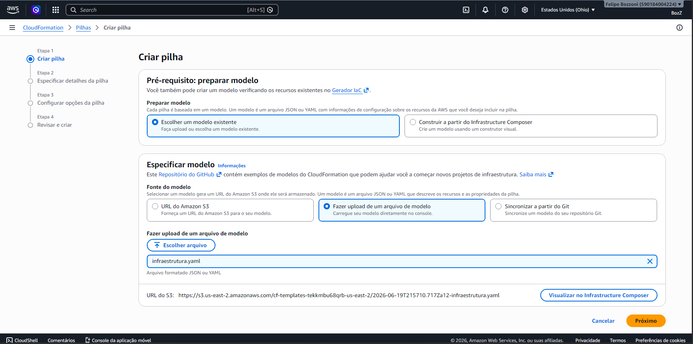
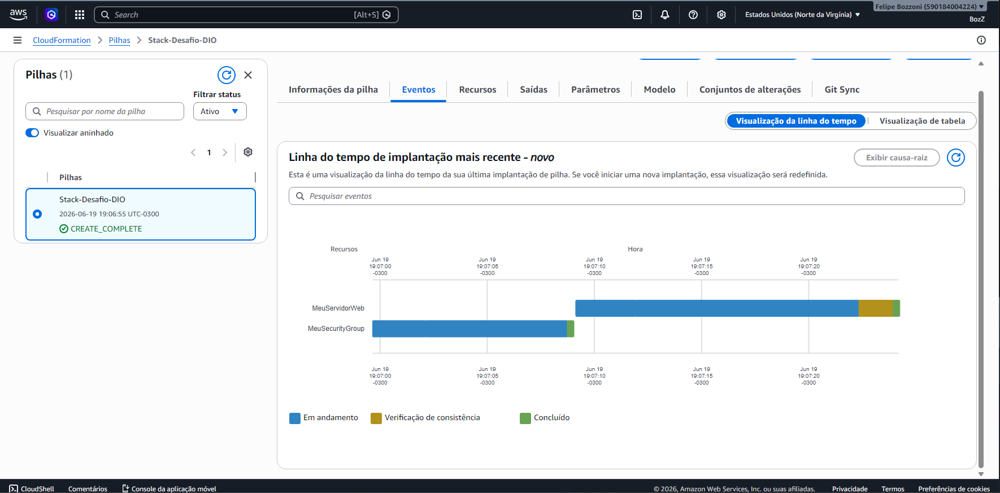
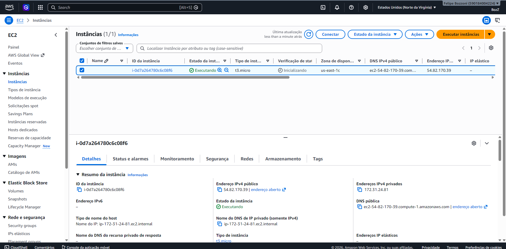
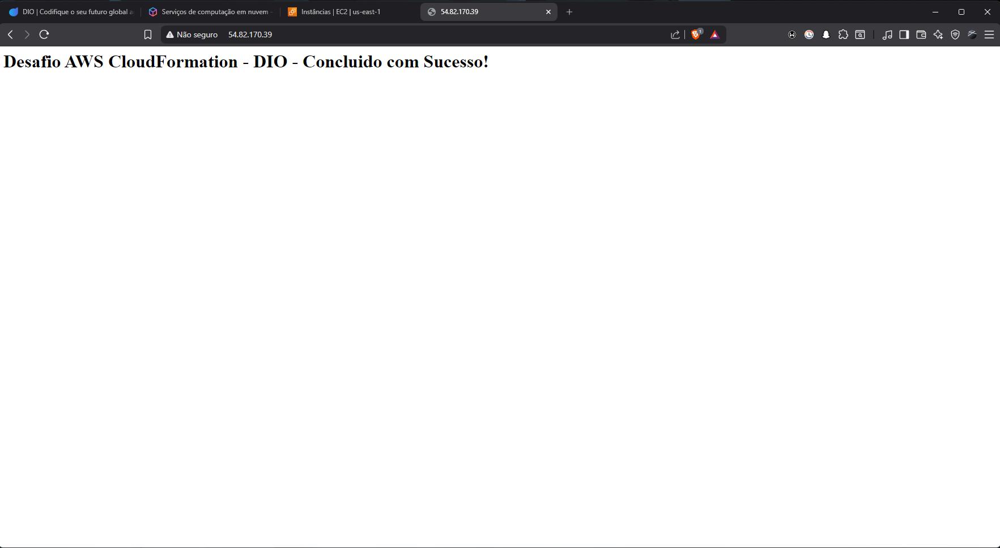

# Desafio de Projeto: AWS CloudFormation ☁️

Este repositório contém a entrega do laboratório prático da DIO, com o objetivo de implementar uma Stack utilizando **AWS CloudFormation**.

## 🎯 Objetivo do Projeto
Praticar a automação de infraestrutura em nuvem (Infraestrutura como Código - IaC) através da criação de um template YAML. O projeto provisiona automaticamente:
- Uma instância EC2 (Servidor Web).
- Configuração de um Security Group liberando tráfego HTTP (80) e SSH (22).
- Instalação automática do servidor Apache (`http`) via UserData.

## 🛠️ Tecnologias Utilizadas
- AWS CloudFormation
- AWS EC2
- YAML
- Shell Script (UserData)

## 🚀 Passo a Passo da Implementação e Evidências

Abaixo está o registro visual de todo o processo de automação e provisionamento da infraestrutura na nuvem AWS utilizando o CloudFormation.

---

### Passo 1: Upload do arquivo YAML
O processo começou com o upload do template configurado em **YAML** (`infraestrutura.yaml`) diretamente no console do AWS CloudFormation, preparando o ambiente para o deploy.



---

### Passo 2: Criação da Stack
Com o arquivo carregado, a criação da **Stack** foi iniciada. O CloudFormation interpretou o código e provisionou o Grupo de Segurança e a Instância EC2 de forma automatizada, finalizando com sucesso (`CREATE_COMPLETE`).



---

### Passo 3: Servidor EC2 Online
Após a conclusão da Stack, a nova instância do **servidor EC2 (`t3.micro`)** foi inicializada com sucesso, ficando totalmente online, ativa e executando no painel de gerenciamento da AWS.



---

### Passo 4: Site Rodando
Por fim, ao acessar o **IP público** gerado pela instância diretamente no navegador, o script de `UserData` foi validado, exibindo a página web configurada rodando perfeitamente no servidor Apache.



## 💡 Insights e Aprendizados
Durante a prática, aprendi que gerenciar infraestrutura via código (IaC) evita erros humanos, permite o versionamento da infraestrutura (como fazemos com software) e agiliza a replicação de ambientes. O recurso de `UserData` foi muito interessante para já subir a máquina configurada sem precisar acessar o terminal SSH.

## 📄 O Código do Template (YAML)

Para a automação da infraestrutura, foi desenvolvido um template em **YAML** utilizando os conceitos de **Infraestrutura como Código (IaC)**. O arquivo foi estruturado de forma dinâmica para ser compatível com restrições de laboratório (como o AWS Academy) e reutilizável em qualquer região da AWS.

Abaixo está o código completo contido no arquivo `infraestrutura.yaml`:

```yaml
AWSTemplateFormatVersion: '2010-09-09'
Description: 'Minha primeira stack na AWS - Desafio DIO: Servidor Web EC2 com Security Group.'

Resources:
  MeuSecurityGroup:
    Type: AWS::EC2::SecurityGroup
    Properties:
      GroupDescription: Permite acesso HTTP (porta 80) e SSH (porta 22)
      SecurityGroupIngress:
        - IpProtocol: tcp
          FromPort: 80
          ToPort: 80
          CidrIp: 0.0.0.0/0
        - IpProtocol: tcp
          FromPort: 22
          ToPort: 22
          CidrIp: 0.0.0.0/0

  MeuServidorWeb:
    Type: AWS::EC2::Instance
    Properties:
      InstanceType: t3.micro
      ImageId: ami-0c101f26f147fa7fd 
      SecurityGroups:
        - !Ref MeuSecurityGroup
      UserData:
        Fn::Base64: |
          #!/bin/bash
          yum update -y
          yum install -y httpd
          systemctl start httpd
          systemctl enable httpd
          echo "<h1>Desafio AWS CloudFormation - DIO - Concluido com Sucesso!</h1>" > /var/www/html/index.html
